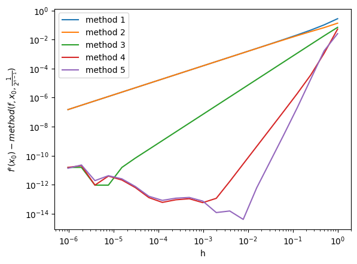
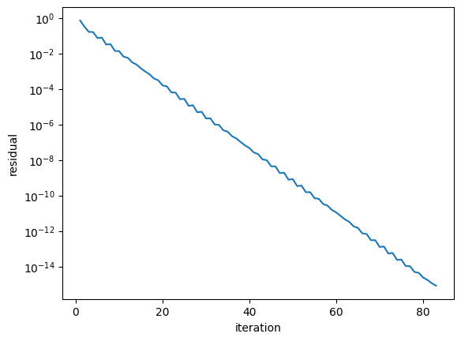
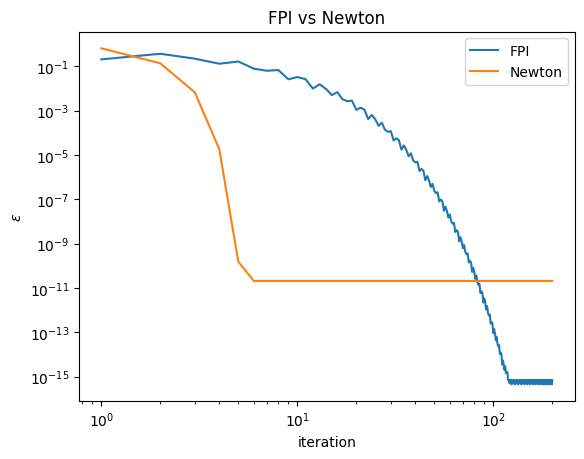
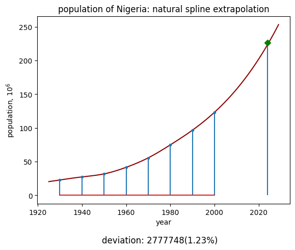
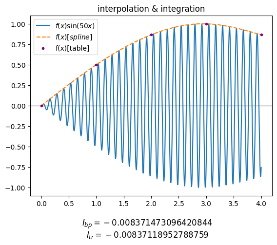
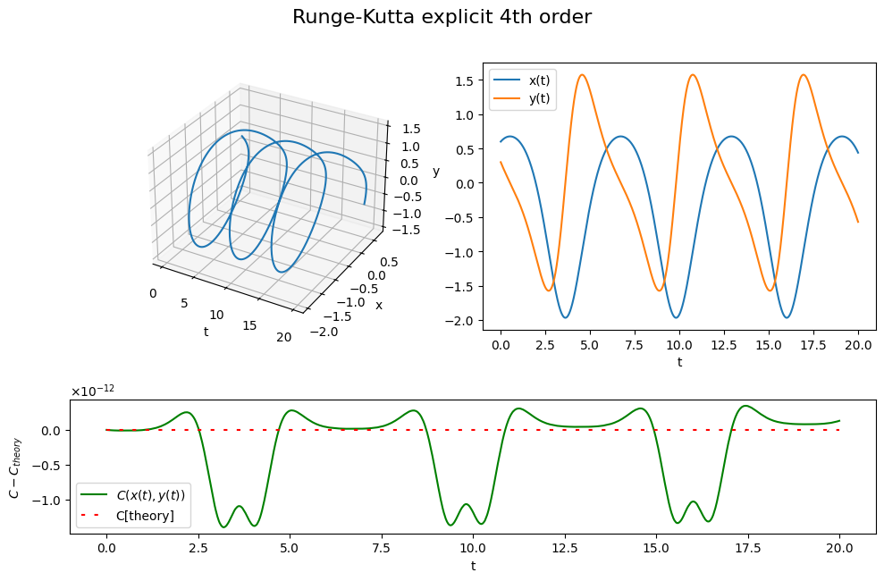
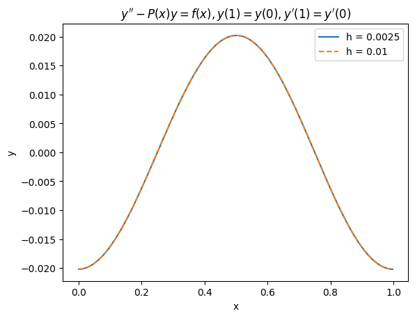

Repository with laboratory works in computational mathematics.

### Lab I[numerical differentiation]:

### Lab II[solving linear systems]:

### Lab III[solving nonlinear equations & systems]:

### Lab IV[interpolation & extrapolation]:

### Lab V[numerical integration]:

### Lab VI[non-stiff ODE systems]:

### Lab VIII[boundary value problem for ODE]:

